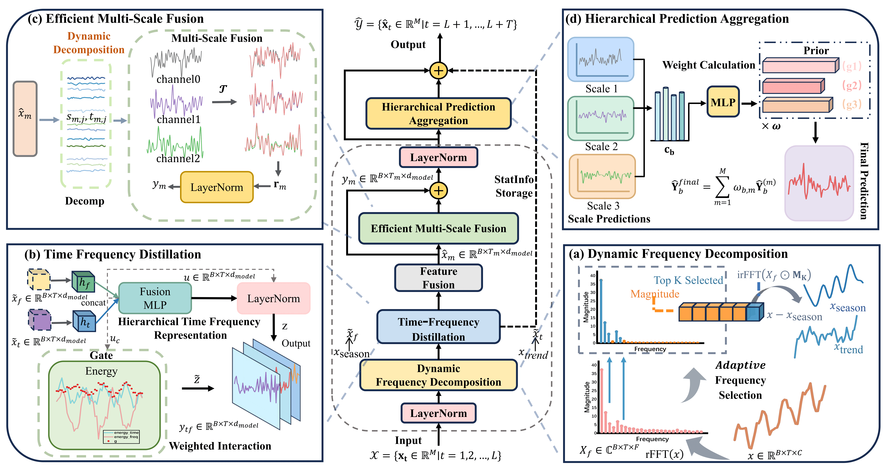
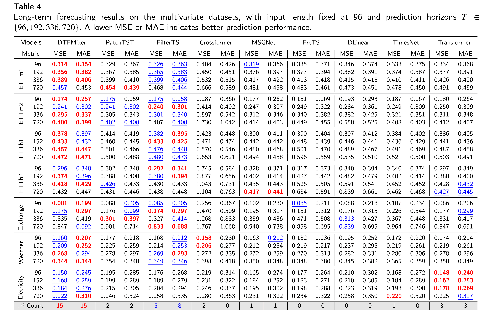
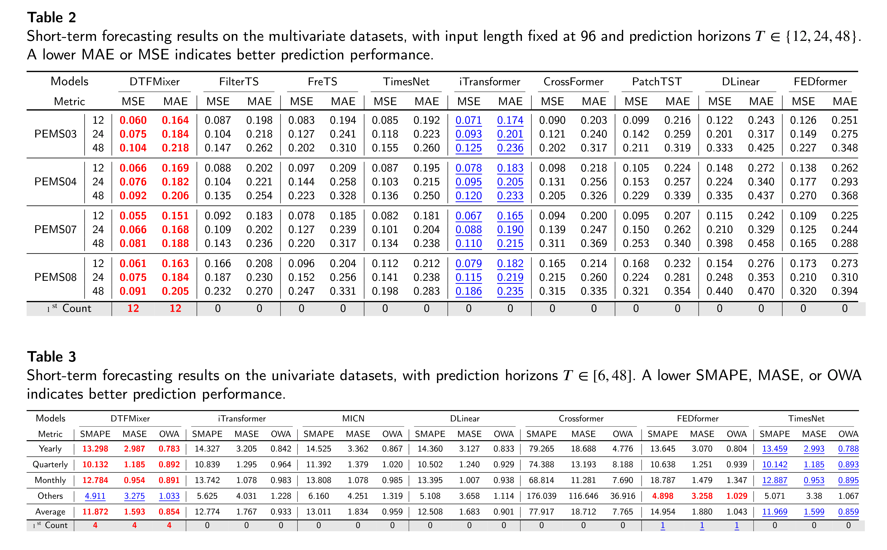

# DTFMixer
The code for **Beyond Static Frequency Decomposition: Dynamic Time Frequency Mixing for Time Series Forecasting**

## Usage
### Environment Setup
Install PyTorch from the official PyTorch website, ensuring the version matches `requirements.txt`. Then install the remaining dependencies:

```bash
pip install -r requirements.txt
```

### Prepare Dataset
All the datasets needed for DTFMixer can be obtained from the [Google Drive](https://drive.google.com/file/d/1l51QsKvQPcqILT3DwfjCgx8Dsg2rpjot/edit) provided in iTransformer. Create a folder named `./dataset/` and place the downloaded files in this directory.

### Training Example
Execute the provided training scripts under `./scripts/`. For example:

```bash
sh ./scripts/short_term_forecast/DTFMixer_PEMS08.sh
```

## Model Architecture
DTFMixer integrates time-domain and frequency-domain information via a hierarchical multi-scale framework. The model consists of four components:

<p align="center">

</p>

- **Dynamic Frequency Decomposition (DFD)**: Adaptively emphasizes predictive spectral components and derives seasonal and trend representations.

- **Time Frequency Distillation (TFD)**: Captures higher-order interactions between temporal and spectral features.

- **Efficient Multi-Scale Fusion (EMSF)**: Integrates complementary information across temporal scales to generate multi-scale feature representations.

- **Hierarchical Prediction Aggregation (HPA)**: Combines predictions at different scales to balance short-term fluctuations and long-term trends.

## Main Experimental Results

### Long-term Forecasting Results
Forecast results on multivariate datasets with input length fixed at 96 and prediction horizons T ∈ {96, 192, 336, 720}. The best and second-best results are marked in red and blue, respectively.

<div align=center>

</div>

### Short-term Forecasting Results
Forecast results on multivariate PEMS datasets and univariate M4 datasets. The best and second-best results are marked in red and blue, respectively.

<div align=center>

</div>

## Acknowledgement

We appreciate the following github repos for their valuable code and effort:

- [FilterTS](https://github.com/wyl010607/FilterTS)
- [LTSF-Linear](https://github.com/cure-lab/LTSF-Linear)
- [TimesNet](https://github.com/thuml/TimesNet)
- [Time-Series-Library](https://github.com/thuml/Time-Series-Library)
- [iTransformer](https://github.com/thuml/iTransformer)
- [PatchTST](https://github.com/yuqinie98/PatchTST)
- [MSGNet](https://github.com/YoZhibo/MSGNet)
